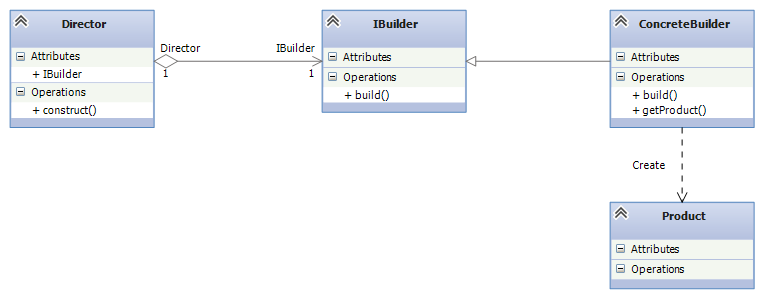

# Installation

npm i

can compile a .ts file with command.
```
npx ts-node intro/ts/intro
```

open repl cli with __npx ts-node__.

A "start" script is deployed in **package.json**
```
{
  "scripts":{
    "start": "npx ts-node"
  },
  "devDependencies": {
    "ts-node": "^10.9.2"
  }
}
```

### NOTE : do not remove tsconfig.json file.

## Strategy

## Observer

## Decorator

## Builder

## State

## Bridge


Design paterns [certificado udemy](patrones_de_diseño.pdf)